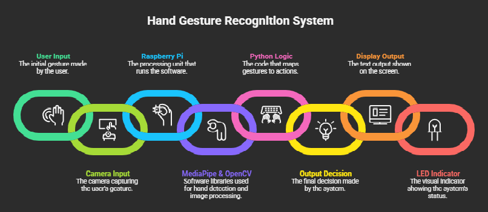
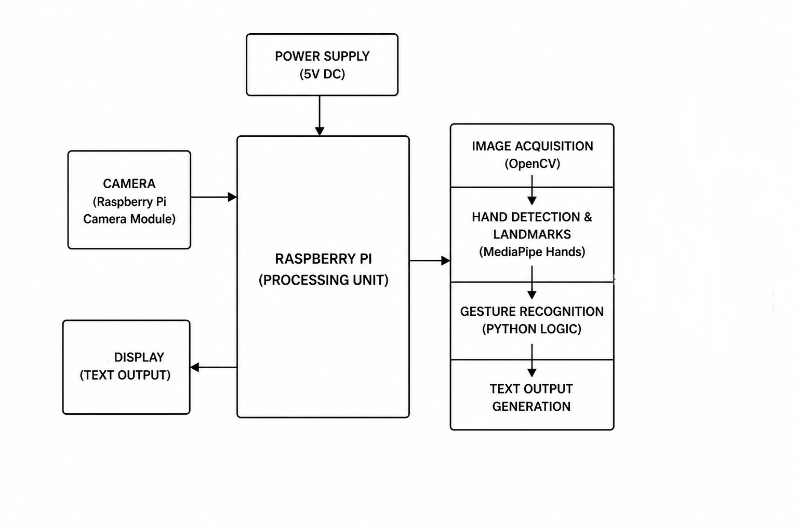

# SKILL LAB PRATICAL HACKATHON

## Final Project README

> **Project Weight:** 100%  
> **Team Size:** 4/3 students  
> **Project Duration:** 16 hours  
> **Total Time Available:** 32 effort-hours per team  
> **Project Type:** Playful, interactive, technology-based experience

---

# Before you begin

## Fork and rename this repository

After forking this repository, rename it using the format:

`SKILLLAB_PROR-2026-TeamName`

### Example

`SKILLLAB_PROR-2026-AuroWizards`

Do not keep the default repository name.

---

# How to use this README

This file is your team’s **working project document**.

You must keep updating it throughout the build period.  
By the final review, this README should clearly show:

- your idea,
- your planning,
- your design decisions,
- your technical process,
- your build progress,
- your testing,
- your failures and changes,
- your final outcome.

## Rules

- Fill every section.
- Do not delete headings.
- If something does not apply, write `Not applicable` and explain why.
- Add images, screenshots, sketches, links, and videos wherever useful.
- Update task status and weekly logs regularly.
- Use this file as evidence of process, not only as a final report.

---

# 1. Team Identity

## 1.1 GestureX

## 1.2 Team Members

|       Name            |           Primary Role         |    Secondary Role    | Strengths Brought to the Project |
| --------------------- | -------------------------------| -------------------- | -------------------------------- |
|  `Ayush Sanjay Piwal` |          `Electronics`         |    `Documentation`   |   `Hardware, Material Handling`  |
|    `Saurabh Maurya`   |           `Hardware`           |       `Coding`       |       `Material Handling`        |
|    `Samiksha Pawar`   |         `Research/ App`        |  `Material Handling` |       `Literature Survey`        |
|      `Rajat Saha`     |           `Hardware`           |       `Coding`       |       `Material Handling`        |

## 1.3 Project Title

`"Hand Gesture Recognition"`

## 1.4 One-Line Pitch

`An Raspi-powered system that understands hand gestures inspired by sign language and translates them into real-time digital communication.`

## 1.5 Expanded Project Idea

This project is an AI-based gesture communication system that allows a user to express common phrases like “hello,” “how are you,” or “thank you” using simple hand gestures. A camera connected to the system captures live video, and the software analyzes the hand movements and finger positions to recognize predefined gestures. Once a gesture is identified, the system converts it into a corresponding text message and displays it on the screen, effectively acting as a real-time translator from gestures to language.

The experience it creates is interactive and intuitive users can communicate without speaking or typing, simply by using natural hand movements. This makes the system feel responsive and intelligent, almost like it “understands” human gestures. The project uses a combination of hardware and software technologies, including a Raspberry Pi Camera Module for visual input, a Raspberry Pi for processing, and computer vision libraries such as OpenCV and MediaPipe Hands to detect and interpret hand gestures in real time.

---

# 2. Inspiration

## 2.1 References

List what inspired the project.

| Source Type | Title / Link                                                        | What Inspired You                                                                         |
| ----------- | ------------------------------------------------------------------- | ----------------------------------------------------------------------------------------- |
| `[Video]`  | `https://youtu.be/EWaYOil--sQ?si=znA4aHTRdHi46k4-` | `How to use MediaPipe + OpenCV on Raspberry Pi to capture camera input, detect hand landmarks, and recognize hand gestures.` |
|  `[Video]`  | `https://youtu.be/a7B5EZVHHkw?si=W97N1txiP9AJvZIg`          |    `how to integrate camera + OpenCV`                                                                                    |
|  `[Research Paper]`   |  `https://ieeexplore.ieee.org/document/10425411`                                                             | `Learned how to build a real-time hand gesture recognition system using MediaPipe and OpenCV for controlling devices in embedded/IoT applications`                                                                                         |

## 2.2 Original Twist

What makes our project special is that it doesn’t just detect gestures, it understands and interprets them like a communication system. Most existing projects either use simple sensors (like tilt = LED ON) or basic vision (just detecting a hand), but our system goes a step further by using AI to convert real hand gestures into meaningful phrases in real time. This makes it feel less like a demo and more like an actual human–computer interaction system.
Another key differentiator is the combination of intelligent software and practical hardware. By using the Raspberry Pi Camera Module along with advanced vision tools like MediaPipe Hands and OpenCV, our project performs real-time hand tracking and gesture recognition without needing heavy external systems. It creates a natural, touch-free way of communication that can be extended to accessibility applications, smart interfaces, or assistive technology making it both technically impressive and practically meaningful. 

---

# 3. Project Intent

## 3.1 User Journey 

A user walks up to the system and powers on the Raspberry Pi. Within a few seconds, the camera feed appears on the screen, showing a live view from the Raspberry Pi Camera Module. The interface prompts the user to place their hand in front of the camera. As soon as the hand enters the frame, the system powered by MediaPipe Hands detects it and begins tracking the fingers in real time. The user raises an open hand, and the system instantly recognizes the gesture and displays “HELLO” on the screen. Curious, the user tries another gesture holding up two fingers and the system responds with “HOW ARE YOU.” Each action feels immediate, almost like the system is understanding them.

As the interaction continues, the user experiments with different gestures, watching the system respond with different phrases. When they make a fist, the message “I AM FINE” appears, followed by “THANK YOU” when they show a thumbs up. The experience becomes intuitive and engaging, requiring no physical contact just natural hand movements. By the end, the user realizes they’ve communicated multiple messages without speaking or typing, experiencing a seamless blend of AI and human expression through a simple, interactive interface.  

---

# 4. Definition of Success

The project is successful if it can reliably detect and interpret predefined hand gestures in real time and convert them into correct text outputs with minimal delay. When a user performs a gesture in front of the Raspberry Pi Camera Module, the system—powered by MediaPipe Hands should accurately recognize it and display the intended phrase within a second. Success also means the system runs smoothly on the Raspberry Pi without crashes, works under normal lighting conditions, and demonstrates consistent performance during live testing or presentation.

## 4.1 Definition of “Usable”

The system is considered usable if a new user can operate it without any prior training or technical knowledge. The interaction should feel natural, users simply place their hand in front of the camera and perform gestures without needing instructions every time. The gestures should be easy to perform, clearly distinguishable, and consistently recognized by the system. Additionally, the output (text on screen or LCD) should be clearly visible and understandable, ensuring that the overall experience is simple, intuitive, and frustration free.

## 4.2 Minimum Usable Version

This version is the minimum, because it skips advanced additions like full sentence construction, gesture sequences, LCD integration, or extra sensors, but still proves the main idea that is the system can see a hand, understand a gesture, and convert it into meaningful text instantly.

## 4.3 Stretch Features

Once our core system (gesture -> text) is working, these are extra features that are nice to have but not essential for it to function:

Voice output (text-to-speech): Converting detected phrases into spoken audio so the system can “talk” as well as display text.
LCD display integration: Showing output on a compact external screen instead of just the monitor for a more embedded feel.
Data logging: Saving detected gestures and timestamps for analysis or demonstration purposes.

---

# 5. System Overview

## 5.1 Project Type

- [x] Electronics-based

- [ ] Mechanical

- [x] Sensor-based

- [ ] App-connected

- [ ] Motorized

- [ ] Sound-based

- [ ] Light-based

- [x] Screen/UI-based

- [ ] Fabricated structure

- [ ] Game logic based

- [x] Installation

- [ ] Other:

## 5.2 High-Level System Description

Explaination of how the system works can be shown in simple terms:

- Input (what the system receives):
 
  The system takes input through a camera. The Raspberry Pi Camera Module continuously captures live video of the user’s hand. This video acts as the raw input, showing different hand gestures and finger positions.
  
- Processing (what the system does with it):
 
  The captured video is sent to the Raspberry Pi, where software processes it. Using MediaPipe Hands, the system detects the hand and identifies key points on the fingers. Then, with the help of OpenCV, the program analyzes these points to determine which gesture is being shown. The code compares the detected gesture with predefined patterns and decides what it means (for example, open hand = “HELLO”).
  
- Output (what the system gives back):
  
  Once a gesture is recognized, the system displays the corresponding message on the screen. This could be shown on the monitor or an optional LCD display. For example, if the user shows a thumbs-up, the output might be “THANK YOU.”
  
- Physical structure (how it is built):

  Raspberry Pi (main processor), camera module connected to the Pi, optional components like LCD, LED, or buzzer. All components are connected directly to the Raspberry Pi, which acts as the central controller.

- App interaction if any:
  
  There is no separate mobile or web app required. The entire system runs locally on the Raspberry Pi using Python. The user interacts directly with the system by showing gestures in front of the camera, making it a touch-free and app-free interaction. 

## 5.3 Input / Output Map
| System Part | Type | What It Does |
| ----------- | ---- | ------------ |
| Raspberry Pi Camera Module | Input | Captures live video of the user’s hand gestures |
| Hand Gesture (User) | Input | Provides visual gestures inspired by sign language for recognition | 
| MediaPipe Hands | Processing | Detects hand and tracks finger positions |
| OpenCV | Processing | Processes video frames and helps analyze gesture patterns |
| Gesture Logic (Python Code) | Processing | Matches detected hand patterns with predefined gesture meanings |
| Raspberry Pi | Processing | Acts as the main controller that runs all computations |
| Display (Monitor/LCD) | Output | Shows the recognized text message (e.g., HELLO, THANK YOU) |

---

# 6. System Design, Sketches and Visual Planning 

## 6.1 Concept Architecture/sketch/schematic

---

# 7. Electronics Planning

## 7.1 Electronics Used

| Component                 | Quantity | Purpose                               |
| ------------------------- | --------:| ------------------------------------- |
| `[Raspi]`                 | `1`      | `[Main controller]`                   |
| `Camera (Webcam / Camera module)` | `1`      | `[Tracks hand's gestures]` |
| `LCD Display (optional)` | `1` | `[[Display output message]` |

## 7.2 Wiring Plan

The project is centered around the Raspberry Pi, which acts as the main processing unit. All components are connected directly to it. The Raspberry Pi Camera Module is connected to the Raspberry Pi through the CSI (Camera Serial Interface) port using a ribbon cable. This connection is responsible for sending live video input to the Raspberry Pi for gesture detection.

Optional output components such as an LCD display, LED, or buzzer can be connected to the Raspberry Pi through its GPIO pins. For example, an LED can be connected to a GPIO output pin with a current-limiting resistor and ground, allowing it to blink whenever a gesture is successfully detected. Similarly, an LCD display can be connected via I2C pins (SDA and SCL) to show the recognized text output externally. 

All components share the Raspberry Pi’s power and ground connections, making the Pi the central hub for both input and output devices.

## 7.3 Block Diagram

---

# 8. Software Planning

## 8.1 Software Tools

| Tool / Platform                | Purpose                                        |
| ------------------------------ | ---------------------------------------------- |
| `[Python]`                | `Main programming language used to control the system`                                |
| `[OpenCV]`       | `Captures video and handles image processing` |
| `[MediaPipe Hands]` | `[Detects hand and tracks finger positions]`                      |
| `[Gesture Logic (Custom Code)]`                | `Matches finger positions to specific gestures`                                |
| `[Display Module]`                | `Shows output text on screen or LCD`                                |

## 8.2 Software Logic/Algorithm

- Startup behavior:

  When the system powers on, the Raspberry Pi boots and runs the Python program. The program initializes the camera (via the Raspberry Pi Camera Module), loads required libraries like OpenCV and MediaPipe Hands, and sets up all necessary variables and gesture mappings. The system then displays a ready message such as “Show hand to start.”
  
- Input handling:

  The system continuously captures video frames from the camera. Each frame acts as input. The program ensures the frame is correctly read and converted into a format suitable for processing.
  
- Sensor reading:

  There is no traditional sensor like temperature or gas sensors here—the camera itself acts as the primary input sensor.

The camera captures hand movement

MediaPipe extracts 21 key landmark points of the hand

These points represent finger positions and orientation

- Decision logic:

  This is the most important part. The program analyzes the positions of the finger landmarks to determine which fingers are open or closed.
  
- Output behavior:

  Once a gesture is recognized:

The corresponding message is displayed on the screen.

Optionally, an LED can blink or a buzzer can beep as confirmation.

The output is updated in real time as gestures change.

- Communication logic:

  All processing happens internally on the Raspberry Pi, so no external communication (like Wi-Fi or Bluetooth) is required.
  
- Reset behavior:

  The system does not require a manual reset. It runs in a continuous loop:

If no hand is detected -> it waits

If a new gesture appears -> it processes it immediately

Pressing a key (like ESC) can safely stop the program

---

# 9. Bill of Materials

## 9.1 Full BOM

| Item                             | Quantity | In Kit? | Need to Buy? | Estimated Cost | Material / Spec               | Why This Choice?          |
| -------------------------------- | --------:| ------- | ------------ | --------------:| ----------------------------- | ------------------------- |
| `[RASPI]`                        | `1`      | `Yes`   | `No`         | `0`            | `38 Pin ESP32`                | `[To control components]` |
| `[Micro SD Card (16GB)]`                        | `1`      | `No`   | `Yes`         | `₹600`            | `Class 10 storage`                | `[Stores OS, libraries, and project code]` |
| `[Camera Module]`                 | `[1]`    | `[No]` | `[Yes]`       | `500`            | `[5MP/8MP camera, CSI interface]`                     | `[Captures real-time hand gestures with good clarity]`  |
| `[16x2 LCD (I2C) (Optional)]`          | `[1]`    | `[No]`  | `[Yes]`      | `[150]`        | `[I2C interface display]` | `[Displays output text externally]`    |
| `[Jumper Wires]`                        | `1 set`      | `No`   | `Yes`         | `₹100–₹200`            | `Male-Female wires`                | `[Connect components to GPIO pins]` |
| `[LED]`                        | `1–2`      | `Yes`   | `No`         | `₹10–₹20`            | `5mm standard LED`                | `Visual feedback for gesture detection` |
| `[Resistors]`                        | `2–3`      | `Yes`   | `No`         | `₹5–₹10`            | `220Ω / 330Ω`                | `Limits current for LED protection` |

## 9.2 Material Justification

The components for this project were chosen to balance performance, simplicity, and cost, while still enabling real-time AI-based gesture recognition.

The Raspberry Pi was selected as the main processing unit because it is a compact, affordable single-board computer capable of running Python and handling computer vision tasks efficiently. It supports libraries such as OpenCV and MediaPipe Hands, which are essential for real-time hand detection and gesture analysis. Its built-in GPIO pins also allow easy integration with output components like LEDs, buzzers, or displays, making it ideal for embedded projects.

## 9.3 Items You chose

| Item                 | Why Needed               | Purchase Link | Latest Safe Date to Procure | Status       |
| -------------------- | ------------------------ | ------------- | --------------------------- | ------------ |
| `Web Cam` | `Captures real-time hand gestures with good clarity`   | `https://amzn.in/d/03XP9sAS`     | `3rd May`                | `[Received]` |

## 9.4 Budget Summary

| Budget Item           | Estimated Cost              |
| --------------------- | ---------------------------:|
| Electronics           | `[260]`                     |
| Mechanical parts      | `[600]`                     |
| Fabrication materials | `[0 (Available on campus)]` |
| Purchased extras      | `[0]`                       |
| Contingency           | `[0]`                     |
| **Total**             | `[860]`                     |

## 9.5 Budget Reflection

If the project cost becomes too high, several components can be simplified or replaced without affecting the core functionality:

Remove optional outputs for example the LCD display, LED, and buzzer can be removed since the main output can be shown directly on the monitor. This reduces both cost and wiring complexity.

---

# 10. Planning the Work

## 10.1 Team Working Agreement

Our team of four will work collaboratively by dividing the project into clear roles based on each member’s strengths. One member will focus on hardware setup (connecting the Raspberry Pi Camera Module and basic wiring), one on software development (implementing gesture detection using MediaPipe Hands and OpenCV), one on integration and testing (combining hardware and software, debugging), and one on documentation and presentation (report writing, diagrams, and PPT). However, all members will have a basic understanding of each part to ensure smooth collaboration and backup support when needed.

Decisions will be made through group discussions, where ideas are proposed and the most practical solution is chosen collectively. If a task is delayed, other team members will assist in completing it to keep the project on schedule. 

## 10.2 Responsibility Split

| Area                 | Main Owner     | Support Owner |
| -------------------- | ----------     | ------------- |
| Electronics          | `[Samiksha Pawar]`           | `[Rajat Saha]`          |
| Coding               | `[Rajat Saha]`           | `[Saurabh Maurya]`          |
| Mechanical build     | `[Ayush Piwal]`           | `[Saurabh Maurya]`          |
| Testing              | `[Saurabh Maurya]`           | `[Samiksha Pawar]`          |
| Documentation        | `[Ayush Piwal]`           | `[Samiksha Pawar]`          |

---

# 11 hour Milestones

## 11.1 8-hour Plan(tentetively you may set)

### Bi Hour 1 — Plan and De-risk

Expected outcomes:

- [x] Idea finalized
- [x] Core interaction decided
- [ ] Sketches made
- [x] BOM completed
- [x] Purchase needs identified
- [ ] Key uncertainty identified
- [x] Basic feasibility tested

### Bi Hour 2 — Build Subsystems

Expected outcomes:

- [x] Electronics tests completed
- [x] CAD / structure planning completed
- [ ] App UI started if needed
- [x] Mechanical concept tested
- [ ] Main subsystems partially working

### Bi Hour 3 — Integrate

Expected outcomes:

- [x] Physical body built
- [x] Electronics integrated
- [x] Code connected to hardware
- [ ] App connected if required
- [ ] First playable version exists

### Bi Hour 4 — Refine and Finish

Expected outcomes:

- [x] Technical bugs reduced
- [x] Playtesting completed
- [x] Improvements made
- [x] Documentation completed
- [x] Final build ready

## 12.2  Update Log

| Days   | Planned Goal   | What Actually Happened | What Changed   | Next Steps     |
| ------ | -------------- | ---------------------- | -------------- | -------------- |
| Day 1 | `[Completion of code and hardware implementation]` | `[Detection of fingers and hand gestures]`         | `[-]` | `[Working on errors]` |
| Day 2 | `[Making the codes error free]` | `[Errors were fixed and final project was build]`         | `[Lag was improved]` | `[-]` |

---

# 13. Risks and Unknowns

## 13.1 Risk Register

| Risk                                                            | Type         | Likelihood | Impact   | Mitigation Plan                                                                       | Owner                |
| --------------------------------------------------------------- | ------------ | ---------- | -------- | ------------------------------------------------------------------------------------- | -------------------- |
| WiFi connection between laptop and Raspi becomes unstable       | `Technical`  | `Medium`   | `High`   | Keep Raspi properly connected, reduce network load, add fail-safe stop | `[Saurabh Maurya]`           |

---

# 14. Testing 

## 14.1 Technical Testing Plan

| What Needs Testing     | How You Will Test It                                                                 | Success Condition                                                                                    |
| ---------------------- | ------------------------------------------------------------------------------------ | ---------------------------------------------------------------------------------------------------- |
| `[Wifi connection]`    | `[IP was visible on our laptop system]`                                              | `[OS will will work properly]`                                                   |
                       
                       
## 14.2 Testing and Debugging Log

| Date          | Problem Found                         | Type         | What You Tried                                | Result               |
| ------------- | ------------------------------------- | ------------ | --------------------------------------------- | -------------------- | ---------------------------------------------- |
| `30th April`  | `MediaPipe installation failed`          | `Technical` | `Installing MediaPipe Library on OS` | `Worked`             | 

## 14.3 Playtesting Notes

| Tester      | What They Did                        | What Confused Them                    | What They Enjoyed                         | What You Will Change                          |
| ----------- | ------------------------------------ | ------------------------------------- | ----------------------------------------- | --------------------------------------------- |
| `Gopal` | `Tried navigating through obstacles` | `Some obstacles ewren't clear enough` | `Liked projection + real car interaction` | `Add a slight red highlight around obstacles` |

---

# 15. Build Documentation

## 15.1 Fabrication Process(if any)

None

## 16 Build Photos

# 17. Final Outcome

## 17.1 Final Description

The final version of our project is an Raspi-based gesture communication system that uses a camera to recognize hand gestures inspired by sign language and convert them into meaningful text in real time. The system is built around a Raspberry Pi, which processes live video input from the Raspberry Pi Camera Module. Using advanced computer vision libraries such as MediaPipe Hands and OpenCV, the system detects hand landmarks, analyzes finger positions, and identifies predefined gestures accurately.

When a user performs a gesture in front of the camera, the system interprets it and instantly displays the corresponding phrase (such as “HELLO,” “HOW ARE YOU,” or “THANK YOU”) on the screen. The interaction is fully touch-free and happens in real time, creating a smooth and intuitive user experience. Optional feedback components like LEDs or an LCD display can enhance the system by providing visual confirmation or standalone output.

Overall, the final system demonstrates a practical application of Raspi and computer vision for gesture-based communication. It highlights how simple hardware combined with intelligent software can enable natural human–computer interaction and can be extended for accessibility, assistive communication, or smart interface applications.

## 17.2 What Works Well

One of the strongest aspects of the project is its real-time gesture recognition capability. Using the MediaPipe Hands along with OpenCV, the system is able to quickly detect hand positions and respond almost instantly. This creates a smooth and interactive experience where users can see immediate results when they perform gestures.

Another area that works well is the simplicity and reliability of the hardware setup. The Raspberry Pi Camera Module integrates seamlessly with the Raspberry Pi, allowing stable video input without complex wiring. Since most of the intelligence is handled in software, the system remains easy to set up and maintain.

## 17.3 What Still Needs Improvement

One area that needs improvement is gesture recognition accuracy under different conditions. The system currently works best in good lighting and with a clear background, but performance can drop in low light or cluttered environments. Although MediaPipe Hands is powerful, additional tuning and filtering are needed to make detection more stable and reliable in real-world situations.

Another limitation is the restricted number of gestures. At present, the system supports only a small set of predefined gestures, which limits communication. Expanding the gesture set and improving differentiation between similar hand signs would make the system more expressive and closer to real sign language usage.

## 17.4 What Changed From the Original Plan

Initially, our project idea was to develop a virtual mouse system combined with a gesture-based password mechanism, where hand gestures would be used to control the cursor and also act as a secure input method for authentication. This concept focused more on human–computer interaction and security applications, requiring precise gesture tracking and control.

However, during development, we shifted our focus to a gesture-based communication system inspired by sign language. This change was made because implementing a reliable virtual mouse and password system required very high precision, calibration, and complex control logic, which was difficult to achieve consistently on the Raspberry Pi. Instead, by using tools like MediaPipe Hands, we redirected the project toward recognizing clear hand gestures and converting them into meaningful text output, which proved to be more stable and practical.

---

# 18. Reflection

## 18.1 Team Reflection

Our team worked well in terms of collaboration and task distribution. Each member took responsibility for a specific part of the project—hardware setup, software development using MediaPipe Hands and OpenCV, integration/testing, and documentation. We regularly communicated and helped each other when needed, which ensured that no part of the project was completely dependent on one person. This teamwork helped us complete the core functionality successfully.

## 18.2 Technical Reflection

We learned how to set up and power a Raspberry Pi system and make safe, clean connections using GPIO pins. This included connecting components like LEDs, buzzers, and displays, understanding basic voltage/current limits, and using resistors correctly. We also understood how peripherals like the Raspberry Pi Camera Module interface with the Pi (CSI vs GPIO/I2C).

We gained hands-on experience writing Python code for real-time systems. We learned how to capture and process video frames using OpenCV and how to use MediaPipe Hands to detect and track hand landmarks. We also learned to design clear decision logic (mapping finger positions to gestures), handle loops and errors, and optimize code for smoother performance on limited hardware.

The biggest learning was how to combine hardware and software into a working system connecting the camera, running the code, debugging issues, and ensuring all parts communicate properly. We also learned that integration is where most real-world problems appear, and solving them requires teamwork, testing, and iteration. 

## 18.4 If You Had One More hour

With one more hour, we would focus on improving accuracy and user experience. First, we would fine-tune the gesture detection by adjusting thresholds and adding simple smoothing so that the system recognizes gestures more consistently, especially under different lighting conditions. This would involve refining the logic built on MediaPipe Hands and improving how frames are processed using OpenCV.

We would also enhance the user interface by adding clear on-screen labels, gesture instructions, and a confirmation message when a gesture is successfully detected.

` `

---

# 19. Final Submission Checklist

Before submission, confirm that:

- [x] Team details are complete
- [x] Project description is complete
- [x] Inspiration sources are included
- [x] Sketches are added
- [x] BOM is complete
- [x] Purchase list is complete
- [x] Budget summary is complete
- [x] Mechanical planning is documented if applicable
- [ ] App planning is documented if applicable
- [x] Code flowchart is added
- [x] Task breakdown is complete
- [x] Weekly logs are updated
- [x] Risk register is complete
- [x] Testing log is updated
- [x] Playtesting notes are included
- [x] Build photos are included
- [x] Final reflection is written

---

---

